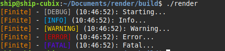

import { Aside } from "@astrojs/starlight/components";

<Aside>FINITE_LOG was last modified in **v0.6.0**</Aside>

The `FINITE_LOG` family of macros provides thread-safe, point to source logging for libfinite applications.

```c
#define FINITE_LOG(fmt, ...)
#define FINITE_LOG_INFO(fmt, ...)
#define FINITE_LOG_WARN(fmt, ...)
#define FINITE_LOG_ERROR(fmt, ...)
#define FINITE_LOG_FATAL(fmt, ...)
```

## Parameters (`finite_log_init`)

| Type                   | Description                                                                                                                                  |
| ---------------------- | -------------------------------------------------------------------------------------------------------------------------------------------- |
| `FILE *out`            | File or stream to output log messages (e.g., `stdout` or a file pointer).                                                                    |
| `FiniteLogLevel level` | Minimum log level to print (`LOG_LEVEL_NONE`, `LOG_LEVEL_DEBUG`, `LOG_LEVEL_INFO`, `LOG_LEVEL_WARN`, `LOG_LEVEL_ERROR`, `LOG_LEVEL_FATAL`).  |
| `bool timestamp`       | Whether to include a timestamp with each log entry.                                                                                          |

## Code Example

```c
#include <finite/log.h>

finite_log_init(stdout, LOG_LEVEL_DEBUG, true);

FINITE_LOG("Starting...");
FINITE_LOG_INFO("Info...");
FINITE_LOG_WARN("Warning...");
FINITE_LOG_ERROR("Error...");
FINITE_LOG_FATAL("Fatal...");

```



## Standard Usage

Initialize the logger using `finite_log_init` before calling any FINITE_LOG macros. Failing to do so will cause FINITE_LOG macros to NOP.

Messages that are below the set log level will not appear.

Optional timestamps are displayed in HH:MM:SS format when withTimestamp is true.

`FINITE_LOG_FATAL` returns the message and then immediately exits. For gracefull shutdowns, use `FINITE_LOG_ERROR` instead.
